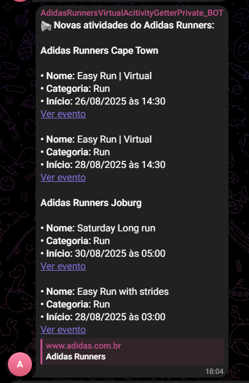
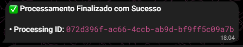
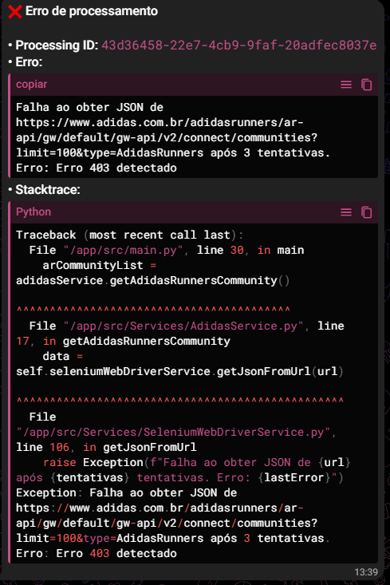

# 🏃‍♂️ Adidas Runners Notifier Bot

## Objetivo do Projeto
Este projeto tem como objetivo monitorar e **enviar atualizações sobre eventos da comunidade Adidas Runners** diretamente para o seu Telegram via bot.

---

## 📦 Estrutura do Projeto

```text
adidas-runners-bot/
├── .github/                               # Configurações específicas para GitHub
│   └── workflows/                         # Onde ficam os workflows de CI/CD do GitHub Actions
│       └── python-app.yml                 # Workflow principal
│    
├── ReadmeResources                        # Imagens com os resultados de processamentos
│   ├── ErroAoBuscarAtividades-ChatAdmin.png
│   ├── SucessoComAtividadesEncontradas-ChatAdmin.png              
│   ├── SucessoComAtividadesEncontradas-ChatAdmin.png              
│   └── SucessoSemAtividadesEncontradas-ChatAdmin.png                
│    
├── src/
│   ├── Services/                          # Diretório principal dos serviços
│   │   ├── __init__.py
│   │   ├── AdidasService.py              # Lida com dados da Adidas (comunidades e eventos)
│   │   ├── GoogleSheetsService.py       # Lida com as planilhas, gerenciando eventos ativos e inativos
│   │   ├── LoggerService.py             # Configuração do logging
│   │   ├── SeleniumWebDriverService.py  # Web scraping via Selenium
│   │   ├── TelegramService.py           # Envia mensagens, gera texto, etc
│   │   └── UtilsService.py              # Funções auxiliares como formatação de data
│   │
│   ├── Models/                           # Classes de tipagem / entidades
│   │   ├── __init__.py
│   │   ├── adidasCommunityModel.py
│   │   └── adidasRunnersEventModel.py
│   │
│   └── main.py                           # Ponto de entrada da aplicação
│
├── Testes/                                # Testes unitários espelhando a estrutura da src
│   ├── Services/                          # Diretório principal dos serviços (testes)
│   │   ├── __init__.py
│   │   ├── test_AdidasService.py         # Testes para dados da Adidas (comunidades e eventos)
│   │   ├── test_GoogleSheetsService.py   # Testes para planilhas, eventos ativos e inativos
│   │   ├── test_LoggerService.py         # Testes da configuração do logging
│   │   ├── test_SeleniumWebDriverService.py  # Testes de web scraping via Selenium
│   │   ├── test_TelegramService.py       # Testes de envio de mensagens, geração de texto, etc
│   │   └── test_UtilsService.py          # Testes das funções auxiliares como formatação de data
│   │
│   ├── Models/                           # Testes das classes de tipagem / entidades
│   │   ├── __init__.py
│   │   ├── test_adidasCommunityModel.py
│   │   └── test_adidasRunnersEventModel.py
│   │
│   └── test_main.py                       # Testes do ponto de entrada da aplicação
│
├── .coveragearc                           # Configurações relacionadas ao relatorio de cobertura dos testes
├── .env                                   # Variáveis de ambiente
├── application.log                        # Logs das execuções da aplicação
├── .gitignore                             # Define arquivos e pastas que não devem ser versionados no Git
├── chromedriver                           # Binário do ChromeDriver (Linux) para automação com Selenium
├── chromedriver.exe                       # Binário do ChromeDriver (Windows) para automação com Selenium
├── Dockerfile                             # Instruções para construir a imagem Docker da aplicação
├── requirements.txt                       # Lista de dependências Python necessárias para rodar o projeto
└── README.md                              # Documentação principal do repositório
```

---

## ✅ Como Rodar o Projeto Localmente

### 1. 🔗 Clone o repositório

```bash
git clone https://github.com/seu-usuario/adidas-runners-bot.git
cd adidas-runners-bot/src
```
### 2. 📄 Crie o arquivo `.env`

Na raiz do projeto, crie um arquivo chamado `.env` com o seguinte conteúdo:

```env
TOKEN=seu_token_aqui
CHAT_ID=seu_chat_id_aqui
ADMIN_CHAT_ID=seu_admin_chat_id_aqui
PROXY_USER=seu_proxy_user_aqui
PROXY_PASSWORD=seu_proxy_password_aqui
GOOGLE_CREDENTIALS=sua_google_credentials_aqui
GOOGLE_SHEET_ID=sua_google_sheet_id
```

- TOKEN: Token do bot do Telegram (fornecido pelo BotFather).
- CHAT_ID: ID do chat de destino para mensagens do bot (usuário ou grupo).
- ADMIN_CHAT_ID: ID do chat para mensagens administrativas (logs, alertas).
- PROXY_USER / PROXY_PASSWORD: Credenciais do Proxy DataImpulse.
- GOOGLE_CREDENTIALS: Conteúdo do JSON de credenciais da conta de serviço do Google (veja abaixo como gerar).
- GOOGLE_SHEET_ID: ID da planilha do Google Sheets.

Dicas:
- Use valores diferentes para CHAT_ID e ADMIN_CHAT_ID se quiser separar mensagens operacionais de notificações ao usuário.
- Em ambientes de produção, prefira injetar variáveis de ambiente via orquestrador/CI em vez de manter um `.env` local.

#### Como obter os dados do Telegram

1) Criar o bot no Telegram (BotFather)
- No Telegram, procure por “BotFather” e clique em Start.
- Envie o comando: `/newbot`.
- Forneça um nome (ex.: “Meu Bot Notificador”).
- Forneça um username que termine com “bot” (ex.: `meu_notificador_bot`).
- Ao finalizar, o BotFather exibirá o HTTP API Token. Guarde-o com segurança — ele será o seu `TOKEN`.

Resultado: TOKEN do bot (ex.: `1234567890:ABCdefGhIJK...`).

2) Obter o seu Chat ID
- No Telegram, procure por “GetIDs Bot” ou “userinfobot” e clique em Start.
- O bot responderá com seu ID numérico (chat privado). Use esse valor como `CHAT_ID`.
- Para grupos: adicione o seu bot ao grupo, envie uma mensagem no grupo e use um bot de IDs para obter o `chat_id` do grupo (geralmente começa com `-100...`).

🎥 [Como criar um bot no Telegram e pegar o TOKEN/CHAT_ID/ADMIN_CHAT_ID](https://www.youtube.com/watch?v=uGaJVTPBpkM)

#### Como obter os dados do Google (Sheets e Drive)

1) Criar um projeto no Google Cloud
- Acesse https://console.cloud.google.com e faça login.
- Topo da página: “Selecionar projeto” → “Novo projeto” → defina um nome e crie.

2) Habilitar as APIs necessárias
- Menu: “APIs e serviços” → “Biblioteca”.
- Habilite:
  - Google Drive API
  - Google Sheets API

3) Criar uma conta de serviço
- Menu: “IAM e administrador” → “Contas de serviço” → “Criar conta de serviço”.
- Defina nome (ex.: `svc-sheets-drive`) e conclua.
- Opcionalmente atribua papéis (ex.: “Editor”). Isso pode ser ajustado depois.

4) Gerar e baixar a chave (JSON)
- Abra a conta de serviço criada → aba “Chaves” → “Adicionar chave” → “Criar nova chave”.
- Tipo: JSON → “Criar”. Um arquivo `.json` será baixado. Guarde-o em local seguro e adicione ao `.gitignore`.

5) Obter o ID da planilha
- Abra a planilha no Google Sheets.
- Na URL, copie o trecho entre `/d/` e `/edit`.
  - Ex.: URL `https://docs.google.com/spreadsheets/d/1AbCDeFGhIjkLMNOPqrSTUVwxyz1234567890/edit`
  - `GOOGLE_SHEET_ID = 1AbCDeFGhIjkLMNOPqrSTUVwxyz1234567890`

6) Compartilhar a planilha com a conta de serviço
- Na planilha, clique em “Compartilhar”.
- Adicione o e-mail da conta de serviço (ex.: `nome-da-conta@seu-projeto.iam.gserviceaccount.com`).
- Defina o papel como “Editor” e salve.

🎥 [Como integrar Python com Google Sheets e pegar o GOOGLE_CREDENTIALS/GOOGLE_SHEET_ID](https://www.youtube.com/watch?v=T1vqS1NL89E)
#### Segurança e boas práticas

- Nunca commite o `.env` ou o JSON de credenciais. Use `.gitignore`.
- Em produção, prefira armazenar segredos em um Secret Manager (GCP Secret Manager, Doppler, 1Password, etc.).
- Se precisar colocar o JSON em `GOOGLE_CREDENTIALS`:
  - Converta o arquivo para base64:
    - macOS/Linux: `base64 -i credenciais.json | tr -d '\n'`
    - Windows (PowerShell): `[Convert]::ToBase64String([IO.File]::ReadAllBytes("credenciais.json"))`
  - Armazene o resultado na variável e decodifique no app.
- Rotacione tokens e chaves periodicamente e revogue acessos não utilizados.

### 3. ⚙️ Instalar Dependências

Instale os pacotes necessários com:

```bash
pip install -r requirements.txt
```
### 4. 🚀 Executando o Bot

```bash
python main.py
```
---

## Como rodar os testes unitários

Antes de começar, garanta que as dependências de desenvolvimento estão instaladas (por exemplo, pytest e pytest-cov). Se estiver usando pip, você pode instalar com:
```bash
pip install -r requirements.txt
```

Defina a variável de ambiente PYTHONPATH apontando para a pasta src para que os imports funcionem corretamente.

No PowerShell (Windows):
```powershell
$env:PYTHONPATH = "src/"
```

No Bash (Linux/macOS):
```bash
export PYTHONPATH="src/"
```

Para executar todos os testes:
```bash
pytest Testes
```

Para executar um teste específico (exemplo: arquivo ou teste pontual):
```bash
# Por arquivo
pytest Testes/test_exemplo.py

# Por nome de teste (substring do nome)
pytest -k "nome_do_teste"
```

Para ver logs/saída de print durante os testes:
```bash
pytest -s
```

Para obter um relatório de cobertura:
```bash
pytest -q Testes --cov=src/ --cov-branch --cov-report=term-missing --cov-report=xml:src/coverage.xml
```

Isso irá calcular a cobertura de código do diretório src (incluindo verificação por branch), exibir no terminal as linhas não cobertas (term-missing), gerar um arquivo XML em src/coverage.xml (útil para CI).

---

## 🐳 Dockerfile

Este projeto utiliza um **Dockerfile** otimizado para rodar em **AWS Lambda** com suporte a **Google Chrome Headless + Selenium**.

### 🔎 O que ele faz

1. **Base da imagem**

   * Usa `python:3.11.3-slim` (imagem leve com Python 3.11.3).
   * Configura variáveis de ambiente para evitar cache de bytecode, manter logs em tempo real e definir locale.

2. **Instala dependências do sistema**

   * Pacotes necessários para rodar o **Google Chrome** em modo headless (bibliotecas gráficas mínimas, fontes, utilitários como `curl` e `unzip`).

3. **Instala Google Chrome (stable)**

   * Adiciona o repositório oficial do Chrome.
   * Instala a versão estável do navegador.
   * Define `CHROME_BIN=/usr/bin/google-chrome` para que o Selenium consiga localizar o binário.

4. **Instala dependências Python**

   * Copia o `requirements.txt`.
   * Atualiza `pip` e `wheel`.
   * Instala as dependências do projeto.
   * Instala `awslambdaric`, runtime necessário para executar a aplicação no **AWS Lambda**.

5. **Copia o código do projeto**

   * Copia a pasta `src/` para `/app/src`.
   * Copia o `chromedriver` (da raiz do projeto) para `/app/`.
   * Dá permissão de execução no `chromedriver`.
   * Define `CHROMEDRIVER=/app/chromedriver` como variável de ambiente.

6. **Define o ponto de entrada**

   * `ENTRYPOINT [ "python", "-m", "awslambdaric" ]` → inicializa o runtime da AWS Lambda.
   * `CMD ["main.lambda_handler"]` → define a função handler que será chamada pela Lambda.

---

### ▶️ Como usar localmente

Construir a imagem:

```bash
docker build -t adidasrunnersbot .
```

Rodar a imagem simulando Lambda:

```bash
docker run --rm adidasrunnersbot
```

## 🔄 Github Actions

Este repositório utiliza GitHub Actions para automatizar o processo de testes, build de imagens Docker, deploy na AWS Lambda via ECR e envio de relatórios por e-mail.

O workflow está definido em .github/workflows/python-app.yml.

### Fluxo dos Jobs

1. **`build`**

   * Ambiente: `ubuntu-latest`
   * Instala o **Python 3.11.3**.
   * Instala as dependências do projeto (`requirements.txt`).
   * Executa os testes com **pytest**.
   * Gera relatório de cobertura em XML (`src/coverage.xml`).
   * Publica o relatório de cobertura como artifact no GitHub Actions.
   * Mostra resumo da cobertura no **Job Summary**.

2. **`deploy_aws`**

   * Depende do job `build`.
   * Faz login na AWS usando **GitHub Secrets**.
   * Faz login no **Amazon ECR**.
   * Constrói e publica a imagem Docker no repositório **ECR** `adidasrunners`.
   * Atualiza a função **AWS Lambda** `adidasrunnersbot` para usar a nova imagem.

3. **`send_email`**

   * Sempre roda (`if: always()`), independente de falhas nos jobs anteriores.
   * Monta um resumo do status de todos os jobs (`success`, `failure` ou `skipped`).
   * Envia um e-mail de notificação com:

     * Resultado por job.
     * Branch, commit e autor.
     * Link para o run no GitHub Actions.

---

### ⚙️ Configuração Necessária

Antes de usar o workflow, você precisa configurar **GitHub Secrets** com credenciais de Docker, AWS e SMTP.

#### 🔑 Secrets obrigatórios

* **AWS**
  * `AWS_ACCESS_KEY_ID`
  * `AWS_SECRET_ACCESS_KEY`

-----
* **SMTP (para envio de e-mail)**
  * `SMTP_SERVER` → servidor SMTP
  * `SMTP_PORT` → porta SMTP (ex: `587`)
  * `SMTP_USERNAME` → usuário da conta de e-mail
  * `SMTP_PASSWORD` → senha ou token do e-mail
  * `EMAIL_FROM` → remetente
  * `EMAIL_TO` → destinatário(s)

#### Como configurar SMTP (Exemplo com Gmail)

##### 1. Pré-requisitos (exemplo com Gmail)

* Ative a **Verificação em 2 Etapas** na sua conta Google.
* Gere uma **App Password**.
* Utilize essa **App Password** como `SMTP_PASSWORD` no GitHub Secrets.

##### 2. (Gmail) Coletar configurações SMTP

* **Servidor SMTP:** `smtp.gmail.com`
* **Porta SSL (implícito):** `465`
* **Porta TLS/STARTTLS:** `587`

##### 3. Criar **Secrets** no GitHub

Vá até **Settings → Secrets and variables → Actions → New repository secret** e crie:

| Nome do Secret  | Valor exato a usar                                 |
| --------------- | -------------------------------------------------- |
| `SMTP_SERVER`   | `smtp.gmail.com`                                   |
| `SMTP_PORT`     | `587` (para TLS) ou `465` (para SSL)               |
| `SMTP_USERNAME` | Seu e-mail (ex.: `seuusuario@gmail.com`)           |
| `SMTP_PASSWORD` | App Password gerada (não use senha normal)         |
| `EMAIL_FROM`    | Remetente (ex.: `adidasrunnersbot@seudominio.com`) |
| `EMAIL_TO`      | Destinatário(s), separados por vírgula             |

> ℹ️ Se estiver usando outro provedor (Outlook, Yahoo, etc.), substitua os valores de `SMTP_SERVER`, `SMTP_PORT` e `SMTP_USERNAME` pelas credenciais do seu serviço de e-mail.

> ℹ️ Qualquer dúvida, siga o tutorial do vídeo: [https://www.youtube.com/watch?v=FFm1to\_vIDc](https://www.youtube.com/watch?v=FFm1to_vIDc)

---

### ▶️ Como rodar

O workflow é acionado automaticamente em:

* **push** para a branch `main`
* **pull request** na branch `main`
* **manual** via **workflow\_dispatch** no GitHub Actions

---

## 🧪 Exemplos de Funcionamento 

1) Sucesso com novas atividades encontradas
- Cenário: Existem novos eventos na comunidade desde a última execução.
- Comportamento esperado:
  - Bot envia mensagem detalhada no chat principal com a lista de eventos novos.
  - Bot envia resumo administrativo no chat de admin (status do processamento, processingId).
  - Planilha: eventos novos são marcados como “ativos”; eventos antigos não mais disponíveis são movidos/atualizados para “inativos”.
- Evidências:
  - Chat (usuário): 
    
  - Chat (admin): 
    

2) Sucesso sem nenhuma atividade encontrada
- Cenário: Não há eventos novos comparado ao estado atual.
- Comportamento esperado:
  - Bot não envia mensagem no chat principal.
  - Bot envia um aviso no chat admin informando que nenhuma atividade nova foi encontrada, juntamente com o processingId e status do processamento.
  - Planilha permanece inalterada.
- Evidências:
  - Chat (admin):
    

3) Erro de processamento
- Cenário: Alguma etapa falha.
- Comportamento esperado:
  - Bot notifica imediatamente o chat admin com:
    - Status do processamento
    - Processing Id
    - Erro retornado
    - Stacktracree
  - Nenhuma mensagem é enviada ao chat principal.
- Evidências:
  - Chat (admin):
    

Esses exemplos tornam o comportamento esperado explícito, ajudam na validação manual/automática e facilitam troubleshooting quando algo sair do previsto.